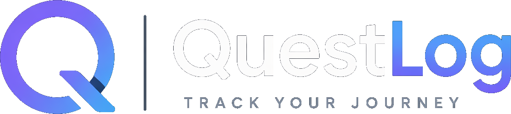

# QuestLog



QuestLog is a small beginner-friendly web app for tracking games you want to play, are currently playing, or have already finished.
It can fetch game metadata and cover art from the RAWG API, and it can import your Steam library through a tiny local Node server.

## Demo

- [Watch the QuestLog demo video](https://youtu.be/6S6tBhGhd-k)
- The demo shows the app running locally with the current game library, Steam import tools, filtering, and tracking workflow.

## Features

- Add a game title
- Choose a status: `Backlog`, `Playing`, `Finished`, `Paused`, or `Dropped`
- Add a personal rating from `1` to `10`
- Search, sort, and filter by status, platform, collections, favorites, and tags
- Edit notes, collections, favorites, and custom tags
- Import your Steam library through a local proxy
- Export or import a JSON backup
- Delete entries
- Save everything in `localStorage`
- Pull matching metadata and cover art from RAWG

## Project Structure

```text
QuestLog/
|-- assets/
|   |-- brand/
|   |   |-- questlog_logo_transparent.png
|   |   `-- questlog_q_icon_transparent.png
|-- desktop/
|   |-- main.js
|   `-- preload.js
|-- scripts/
|   |-- Launch-QuestLog-Desktop.cmd
|   |-- Start-QuestLog.ps1
|   `-- Start-QuestLog-Desktop.ps1
|-- CHANGELOG.md
|-- index.html
|-- package-lock.json
|-- package.json
|-- README.md
|-- server.js
|-- css/
|   `-- styles.css
`-- js/
    `-- app.js
```

## What Each File Does

- `index.html` contains the page structure, form, filter dropdown, and game list container.
- `css/styles.css` controls the layout, colors, spacing, card-based game shelf, and responsive design.
- `js/app.js` handles RAWG lookup, Steam import requests, filtering, editing, backups, theme/view preferences, and saving/loading from `localStorage`.
- `server.js` serves the app on `localhost` and proxies Steam API requests so Steam import works in the browser.
- `desktop/main.js` and `desktop/preload.js` provide the Electron desktop shell.
- `scripts/` contains the browser and desktop launcher helpers.
- `package.json` adds the browser and desktop startup commands.
- `package-lock.json` keeps installs reproducible across machines.
- `README.md` explains the app and folder structure so it is easier to understand later.
- `CHANGELOG.md` tracks shipped versions and mirrors the GitHub release notes cadence.

## How to Run It

1. Make sure Node.js is installed.
2. Open this folder in a terminal.
3. Run `npm start`.
4. QuestLog will open in your browser at `http://localhost:3000`.
5. Add your RAWG key or Steam settings in QuestLog's Settings modal.

### PowerShell launcher

- Run `.\scripts\Start-QuestLog.ps1` to start QuestLog and mirror server output into a timestamped file inside `logs/`.
- If PowerShell blocks scripts on your machine, run `powershell -ExecutionPolicy Bypass -File .\scripts\Start-QuestLog.ps1`.

## How to Run It as a Desktop App

1. Make sure Node.js is installed.
2. Open this folder in a terminal.
3. Run `npm install`.
4. Run `npm run desktop-start`.
5. QuestLog will open in its Electron desktop window and keep its own local app data between relaunches.

### Desktop launchers

- Run `.\scripts\Start-QuestLog-Desktop.ps1` to start the desktop app and mirror startup output into `logs/`.
- Or double-click `scripts\Launch-QuestLog-Desktop.cmd` from File Explorer on Windows.

## How to Build the Windows Installer

1. Make sure Node.js is installed.
2. Open this folder in a terminal.
3. Run `npm install`.
4. Run `npm run dist:win`.
5. The packaged installer will be created inside `dist/`.

### Installer notes

- The Windows build uses Electron Builder with an NSIS installer target.
- The installer creates a normal QuestLog desktop app with Start Menu and desktop shortcuts.
- The packaged desktop build still uses the same local QuestLog UI and bundled local server behavior as the source-based desktop version.

## Notes About the API

- This project uses the RAWG API from the browser, so the API key is stored in `localStorage` for simplicity.
- This project uses a small local server for Steam import because Steam requests are not reliable from a plain local HTML file.
- That is fine for a small personal project, but it is not secure enough for a production app.
- RAWG asks for attribution when you use their data and images, so the app includes a source credit in the interface.
- Code in this repository is licensed under the MIT License in [LICENSE](LICENSE).
- Branding assets are covered by [LICENSE-LOGO-CC-BY-4.0.txt](LICENSE-LOGO-CC-BY-4.0.txt).
